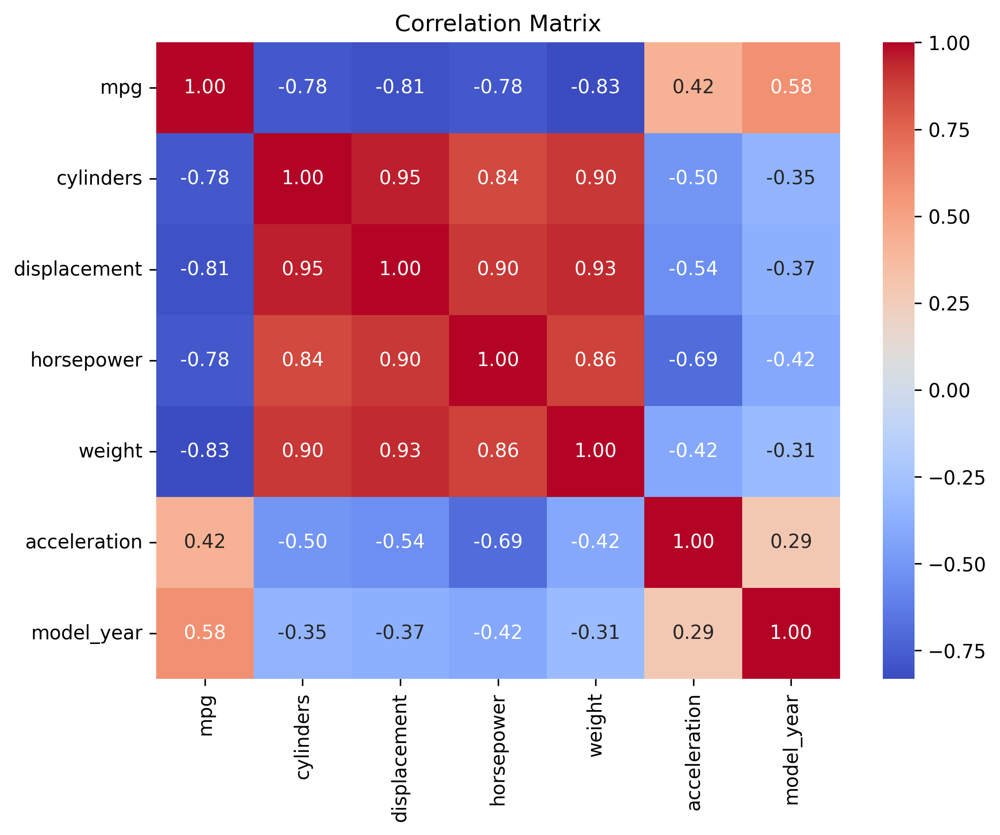
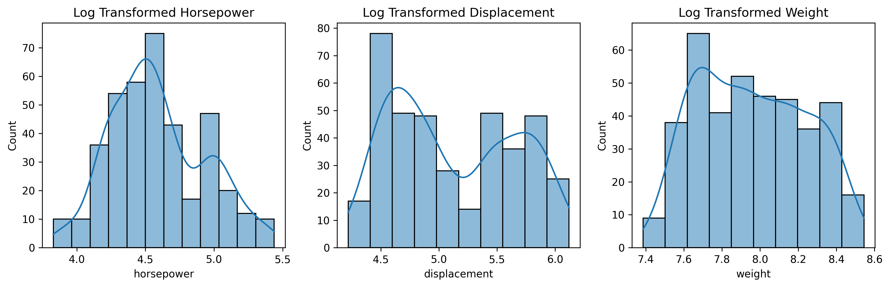
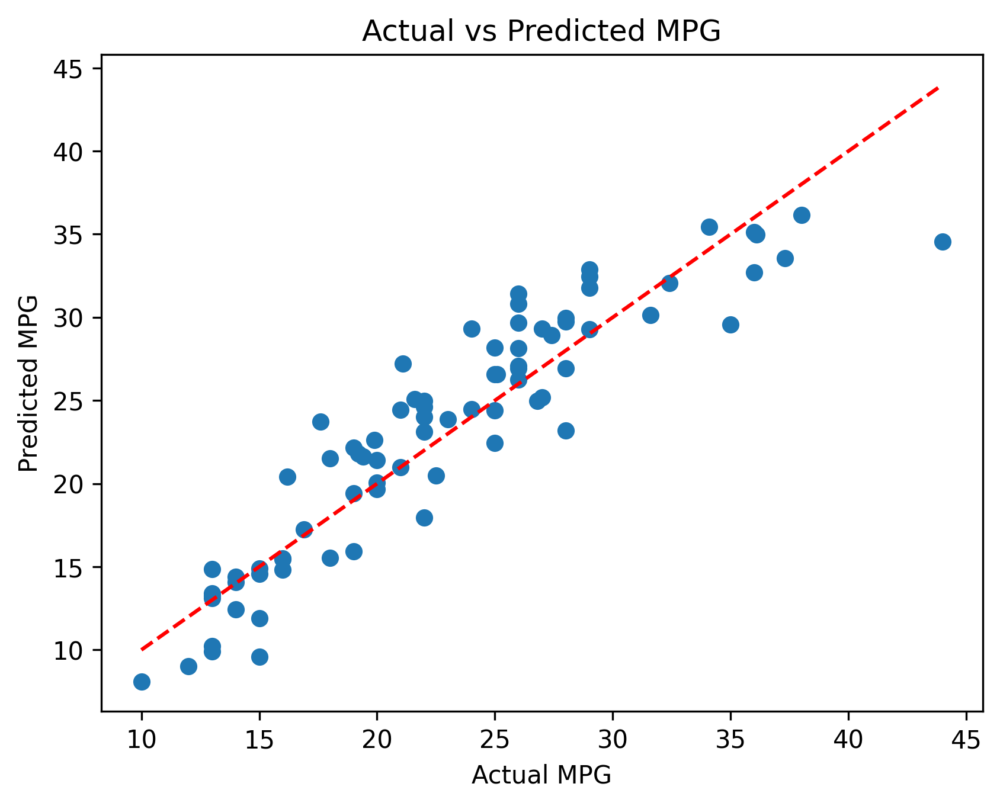
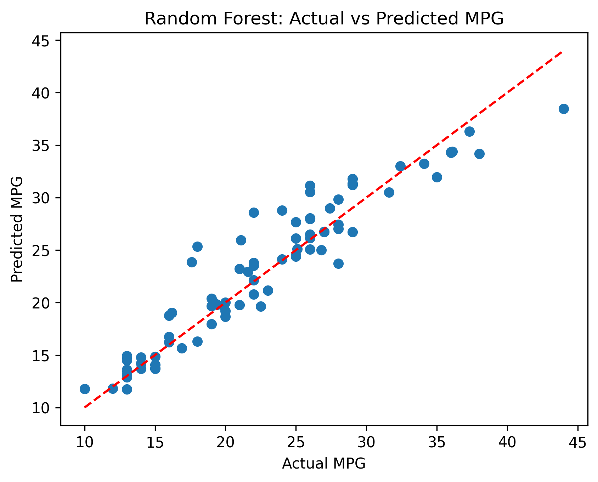

## 🚗 Fuel Efficiency Prediction using Machine Learning

Predicting vehicle fuel efficiency (MPG) using machine learning regression models and comparing Linear Regression with Random Forest Regressor through a complete end-to-end data science workflow.

---

### 📌 Project Overview

This project predicts vehicle fuel efficiency (MPG) using supervised machine learning techniques.

Two regression models were developed and compared:

- Linear Regression
- Random Forest Regressor

The objective is to evaluate which model provides better predictive performance while following a complete machine learning workflow.

---

### 📂 Dataset

The project uses the MPG dataset available through the Seaborn library.

The dataset contains the following vehicle characteristics:

- Cylinders
- Displacement
- Horsepower
- Weight
- Acceleration
- Model Year

**Target Variable:**

- MPG (Miles Per Gallon)

---

### ⚙️ Data Preprocessing

The following preprocessing steps were performed:

- Handling missing values
- Removing unnecessary features
- Exploratory Data Analysis (EDA)
- Log transformation of skewed variables
- One-Hot Encoding of categorical features
- Train-Test Split

---

### 🤖 Models

#### Linear Regression

A Linear Regression model was developed using a Scikit-Learn Pipeline with feature standardization.

#### Random Forest Regressor

A Random Forest model was trained using the same training and testing data to compare predictive performance.

---

### 📊 Model Evaluation

The models were evaluated using:

- R² Score
- Mean Absolute Error (MAE)
- 10-Fold Cross Validation

---

### 📈 Results

The Random Forest Regressor achieved higher predictive accuracy than the Linear Regression model, demonstrating better performance for predicting vehicle fuel efficiency.

---

### 🛠 Technologies

- Python
- Pandas
- NumPy
- Matplotlib
- Seaborn
- Scikit-Learn
- Jupyter Notebook

---

### 📌 Key Learning Outcomes

- Exploratory Data Analysis (EDA)
- Data Preprocessing
- Feature Engineering
- Regression Modeling
- Cross Validation
- Model Comparison
- Performance Evaluation

---

### 📷 Project Visualizations

#### Correlation Matrix

---

#### Log Transformation

---

#### Linear Regression: Actual vs Predicted

---

#### Random Forest: Actual vs Predicted

---

### 👤 Author

**Konstantina Frangou**
